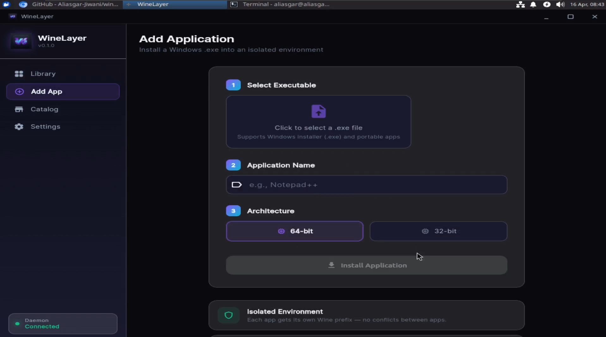

<div align="center">


# WineLayer

### Run Windows apps on Linux — no terminal required.

[](https://www.gnu.org/licenses/gpl-3.0)
[](#)
[](https://flutter.dev)
[](https://python.org)
[](CONTRIBUTING.md)

> **WineLayer is an experience orchestration engine on top of Wine.**  
> It handles everything — installation, environment isolation, dependency resolution, crash detection and auto-fixing — through a polished modern desktop UI. Zero terminal required.

</div>

---

## ✨ What Makes WineLayer Different

| | WineLayer | Bottles | PlayOnLinux | Raw Wine |
|---|:---:|:---:|:---:|:---:|
| No terminal needed | ✅ | ✅ | ❌ | ❌ |
| Auto crash fixer | ✅ | ❌ | ❌ | ❌ |
| One-click Wine install | ✅ | ❌ | ❌ | ❌ |
| App Catalog with scripts | ✅ | Partial | Partial | ❌ |
| VM Sandbox for complex apps | ✅ | ❌ | ❌ | ❌ |
| Community compat database | ✅ | ✅ | ❌ | ❌ |

---

## 🚀 Install in One Command

```bash
curl -fsSL https://raw.githubusercontent.com/Aliasgar-Jiwani/winelayer/main/winelayer/scripts/install.sh | bash
```

This automatically:
- Detects your Linux distro (Ubuntu, Fedora, Arch, and more)
- Installs Wine if it's not already present
- Downloads and installs WineLayer
- Creates a desktop shortcut in your app menu

**Or download manually** from the [Releases Page →](https://github.com/Aliasgar-Jiwani/winelayer/releases)

---

## 📸 Screenshots

<div align="center">
  
  &nbsp;
  
</div>

---

## ✅ Supported Linux Distros

| Distro | Auto Wine Install | Status |
|---|:---:|:---:|
| Ubuntu 22.04+ / Linux Mint / Pop!_OS | ✅ | ✅ Fully Supported |
| Fedora 38+ | ✅ | ✅ Fully Supported |
| Arch Linux / Manjaro / EndeavourOS | ✅ | ✅ Fully Supported |
| openSUSE Leap / Tumbleweed | ✅ | ✅ Fully Supported |
| Debian 12+ | ✅ | ✅ Fully Supported |

---

## 🧠 Features

### 🧩 App Catalog
Browse pre-configured YAML scripts for popular Windows software. One click installs it with the correct Wine configuration, dependencies, and settings — automatically.

### 🔧 Auto-Fix Engine
When an app crashes, WineLayer automatically analyzes the Wine log, matches it against a community error database, and suggests a one-click fix. No Googling required.

### 📦 Generic Installer
Don't see your app in the Catalog? Just drag and drop any `.exe` file. WineLayer creates an isolated Wine environment for it and automatically discovers where it installed.

### 🧪 Micro-VM Sandbox *(Beta)*
For apps that Wine simply cannot handle (like Adobe Creative Cloud or Microsoft Office 365), WineLayer can route them through a background KVM virtual machine and project the window seamlessly to your desktop via RemoteApp.

### 🖥️ Zero Terminal
Every feature — installing, launching, diagnosing, fixing — happens through a beautiful modern GUI. No commands to memorize.

---

## 🏗️ Architecture

WineLayer is two programs that talk to each other:

```
┌─────────────────────────────────────┐
│   Flutter Desktop App (UI)          │  ← What the user sees
│   Dart · Riverpod · Material 3      │
└─────────────────┬───────────────────┘
                  │  JSON-RPC · TCP Socket
┌─────────────────▼───────────────────┐
│   Python Daemon (Backend Engine)    │  ← Where all the real work happens
│   asyncio · SQLAlchemy · SQLite     │
└─────────────────────────────────────┘
```

### Key Modules

| Module | What It Does |
|---|---|
| `installer.py` | Creates Wine prefixes and installs apps |
| `wine_manager.py` | Detects Wine version, manages builds |
| `fix_engine.py` | Applies automated fixes based on log analysis |
| `log_analyzer.py` | Parses Wine logs and matches error signatures |
| `vm_manager.py` | KVM Micro-VM orchestration for complex apps |
| `ipc_server.py` | JSON-RPC socket server bridging UI and backend |
| `compat-db/scripts/` | YAML app compatibility scripts |
| `compat-db/error_rules.json` | Known error → fix mapping database |

---

## 🛠️ Build From Source

```bash
# Requirements: Python 3.11+, Flutter SDK 3.24+, Wine

git clone https://github.com/Aliasgar-Jiwani/winelayer.git
cd winelayer/winelayer

# Install Python dependencies
pip install -e ".[dev]"

# Terminal 1 — Start the backend daemon
python -m daemon.main

# Terminal 2 — Launch the UI
cd app
flutter run -d linux
```

---

## 🤝 How to Contribute

The most impactful way to contribute is to **add a new app to the Catalog**.
If you got a Windows app running with WineLayer, share your setup!

See **[CONTRIBUTING.md](CONTRIBUTING.md)** for the full guide.

### Quick contribution (no coding required):
1. Test a Windows app and note which Wine version and Winetricks packages worked
2. Create a YAML file in `winelayer/compat-db/scripts/`
3. Open a Pull Request

---

## 📋 Development Roadmap

- ✅ **Phase 1** — Core foundation (Flutter shell, Python daemon, SQLite, Wine launch)
- ✅ **Phase 2** — Smart Installer (YAML scripts, Catalog browser, Winetricks integration)
- ✅ **Phase 3** — Auto-Fix Engine (Log analysis, error DB, one-click fixes, community sync)
- ✅ **Phase 4** — Platform Maturity (Micro-VM sandbox for DRM-heavy complex apps)
- 🔄 **Phase 5** — Public Launch (AppImage packaging, CI/CD, community growth)

---

## 📄 License

WineLayer is free software licensed under the **GNU General Public License v3.0**.

See [LICENSE](LICENSE) for full terms.

> WineLayer is an independent project and is **not affiliated with or endorsed by** the Wine Project or WineHQ.

---

<div align="center">

Made with ❤️ for the Linux desktop community.

**[⭐ Star this repo](https://github.com/Aliasgar-Jiwani/winelayer)** · **[🐛 Report a Bug](https://github.com/Aliasgar-Jiwani/winelayer/issues)** · **[💡 Request a Feature](https://github.com/Aliasgar-Jiwani/winelayer/issues)**

</div>
